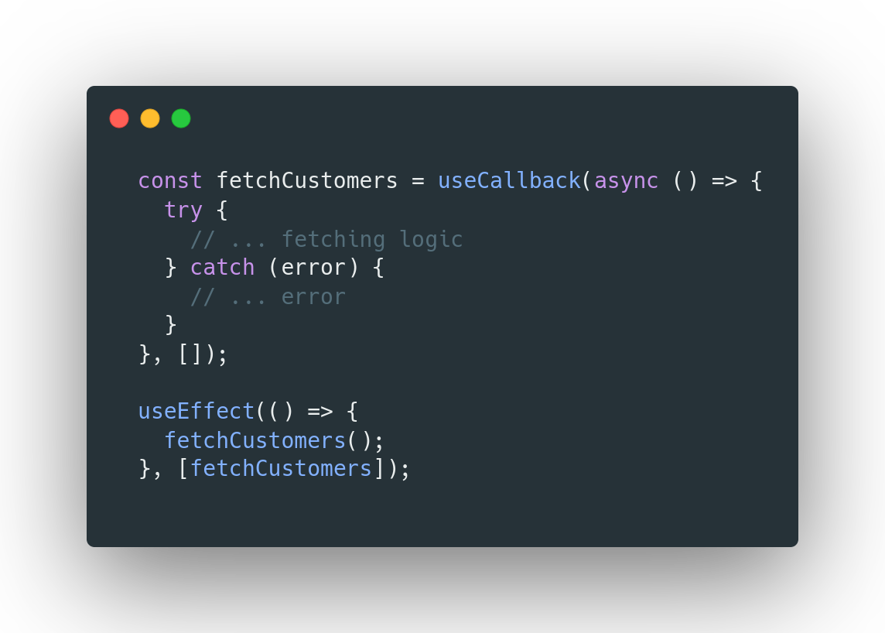

  

 

# About

A simple yet complex ReactJs application where I made sure that all the components are 100% reusable, such as tables, buttons, list groups, input fields, etc...

In this application, I exercised the use of custom hooks and composition to encapsulate the logic necessary for fetching data, handling multiple forms, paginating, and sorting the data on the client side. I also applied cool tricks I learned lately using useCallback() and useMemo() hooks to avoid some annoying React behaviors. **Example:**

  

---

## Necessary environement variable

`REACT_APP_API_URL=https://PathToMyBackend/api`
